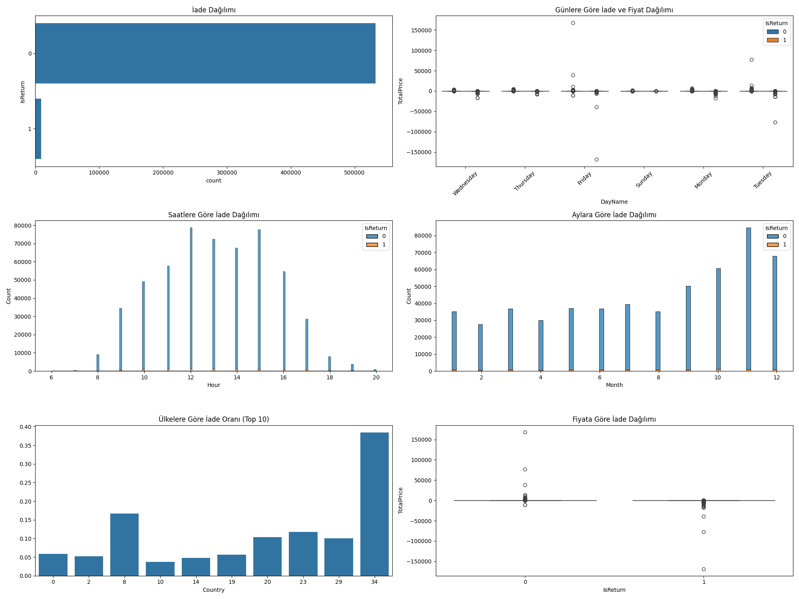
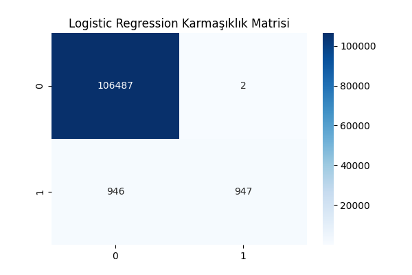
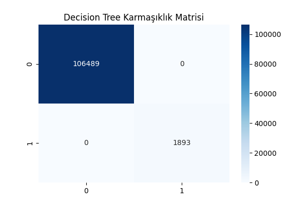
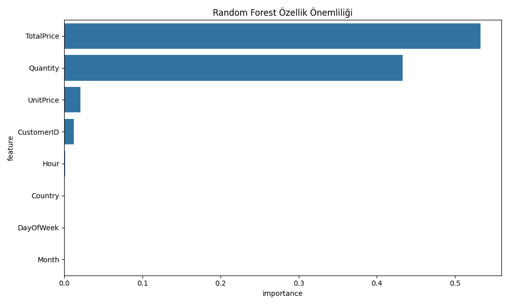
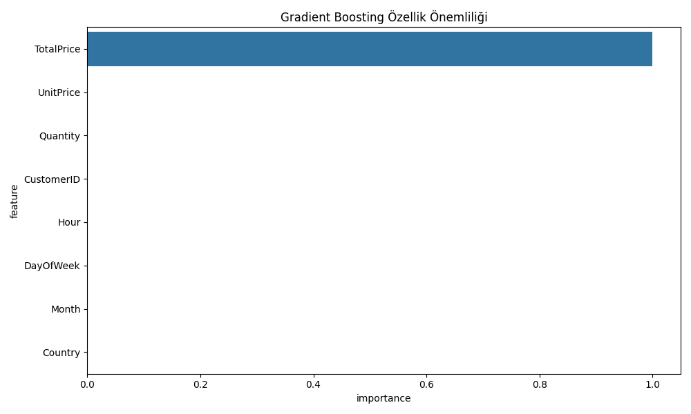

# Online Ürün İade Tahmini Projesi

Bu proje, online alışveriş verilerini kullanarak ürün iadelerini tahmin eden bir makine öğrenmesi uygulamasıdır.

## Veri Analizi

### Detaylı İade Analizi


Bu görsel şunları gösterir:
- İade oranı dağılımı
- Günlere göre iade ve fiyat dağılımı
- Saatlere göre iade dağılımı
- Aylara göre iade dağılımı
- Ülkelere göre iade oranı
- Fiyata göre iade dağılımı

## Model Sonuçları

### Karmaşıklık Matrisleri

#### Logistic Regression


#### Random Forest


#### Decision Tree


### Özellik Önemliliği Analizi

#### Random Forest Özellik Önemliliği


#### Gradient Boosting Özellik Önemliliği


## Özellikler

- 6 farklı makine öğrenmesi algoritması kullanılmıştır:
  1. Logistic Regression
  2. Random Forest
  3. Decision Tree
  4. K-Nearest Neighbors (KNN)
  5. Gradient Boosting
  6. Neural Network (MLP - Bonus)

- Detaylı veri analizi ve görselleştirmeler
- Çapraz doğrulama ile model değerlendirme
- Özellik önemliliği analizi
- Karmaşıklık matrisleri

## Kurulum

1. Gerekli kütüphaneleri yükleyin:
```bash
pip install -r requirements.txt
```

2. Veri setini (`Online Retail.xlsx`) ana dizine yerleştirin

3. Programı çalıştırın:
```bash
python main.py
```

## Çıktılar

Program çalıştırıldığında aşağıdaki dosyalar oluşturulur:
- `detayli_analiz.png`: Veri analizi grafikleri
- `confusion_matrix_*.png`: Her model için karmaşıklık matrisi
- `feature_importance_*.png`: Her model için özellik önemliliği

## Veri Seti

Veri seti şu özellikleri içerir:
- InvoiceNo: Fatura numarası
- StockCode: Ürün kodu
- Description: Ürün açıklaması
- Quantity: Miktar
- InvoiceDate: Fatura tarihi
- UnitPrice: Birim fiyat
- CustomerID: Müşteri ID
- Country: Ülke

## Katkıda Bulunma

1. Bu depoyu fork edin
2. Yeni bir branch oluşturun (`git checkout -b feature/yeniOzellik`)
3. Değişikliklerinizi commit edin (`git commit -am 'Yeni özellik eklendi'`)
4. Branch'inizi push edin (`git push origin feature/yeniOzellik`)
5. Pull Request oluşturun 